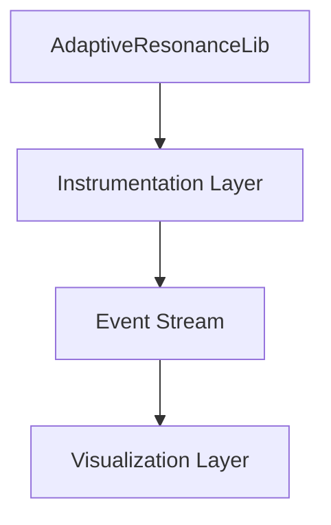

# Architecture

The studio is intended to sit beside AdaptiveResonanceLib and observe the model lifecycle without modifying the core library.

AdaptiveResonanceLib provides the ART algorithms and fitting behavior.

The instrumentation layer will later intercept model activity, state changes, and category formation.

The event stream will expose those observations in a structured, time-ordered form for downstream consumers.

The visualization layer will subscribe to the stream and render the interactive studio experience.